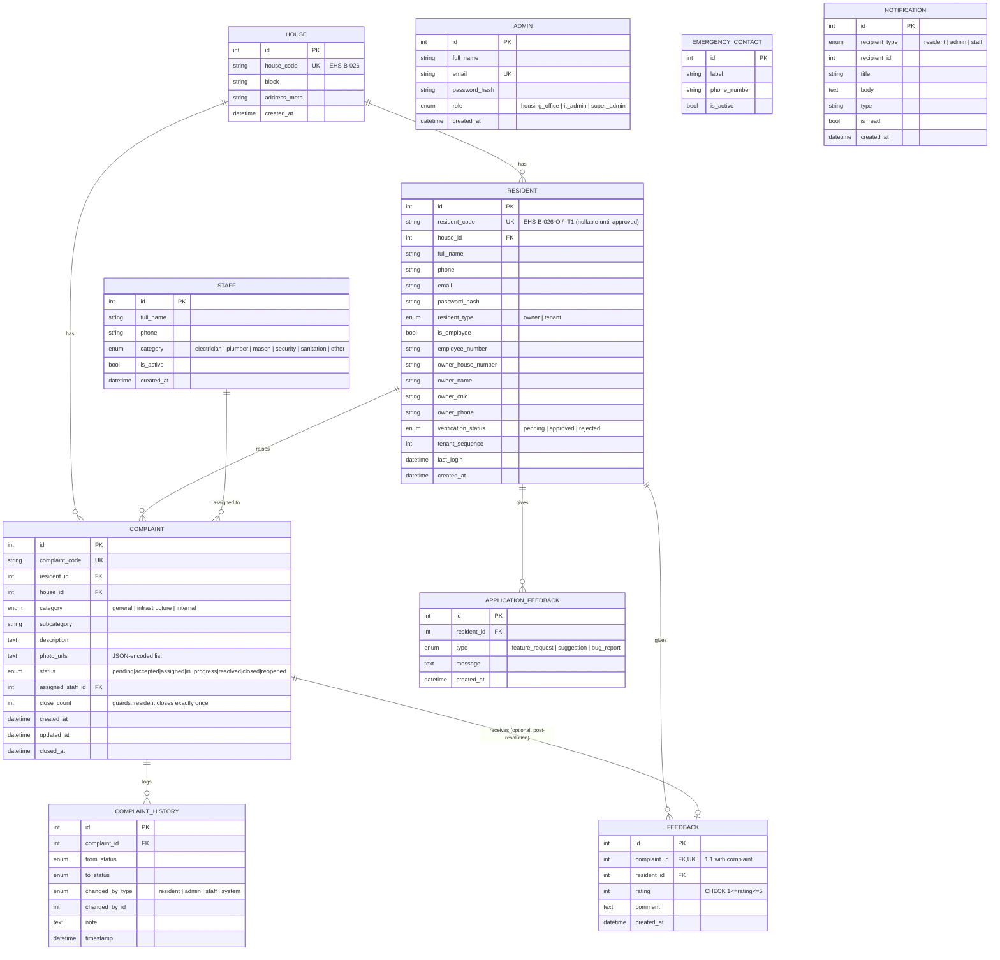

# EHS Next — Entity Relationship Diagram (Module 2)

This diagram reflects exactly what is implemented in `backend/app/models/`.
Rendered from the live SQLAlchemy models and verified against a real
migration (`alembic/versions/88ba86ceafae_initial_schema.py`) — not
hand-drawn from the spec.

## Notes on design decisions

- **`resident_code` is nullable.** A resident row exists from the moment of
  registration (status = `pending`), but the permanent code is only assigned
  by the server once a Housing Office Admin approves it — enforcing the
  "no self-assigned ID, no pre-verification access" rule from Section 6.3.
- **`Admin` and `Staff` are not connected to `Complaint` by history rows
  directly** — `ComplaintHistory.changed_by_id` is a plain integer paired
  with `changed_by_type`, not a foreign key to three different possible
  tables. This is a deliberate simplification (a polymorphic association)
  since SQLAlchemy has no clean native FK-to-multiple-tables construct; it
  is validated at the service layer instead.
- **`close_count` on `Complaint`**, not a separate table, because it's a
  single integer guard checked on every close attempt — no need for the
  overhead of a join.
- **`Feedback` is 1:1 with `Complaint`** via a `unique=True` FK plus
  `uselist=False` on the relationship, matching Section 6.2's "one
  complaint → one feedback" rule at the DB level, not just in application code.
